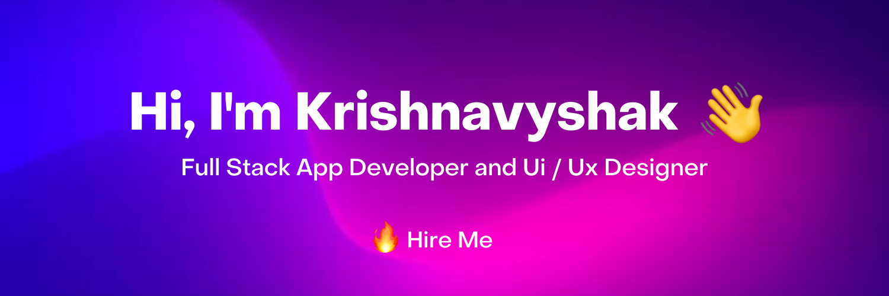
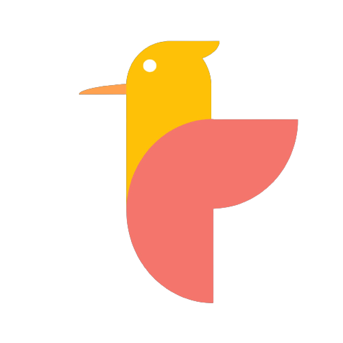

<h1 align="center">Hi , I'm Krishnavyshak R.</h1>
<h3 align="center">I'm a passionate student & developer from India.</h3>

## 🙋‍♂️ About Me

Hi, I'm a self-taught 16-year-old coder who has been working with IDEs since 2017. I enjoy programming in Python and have even designed my own hobby programming language called Bird Script, which some people describe as a 21st-century BASIC!

Loves open-source, 
More about me on my portfolio: <a href="https://vyshak.me">vyshak.me</a>

## 🚀 Languages and Tools:

 
    
    
     
     
     
    
    
    <a href="https://birdscript.tk/" target="_blank"> 
    
    
    
     <a href="https://flutter.google.com/" target="_blank"> 

    

<!--       -->
 

## 📊 My Github Stats

   
    
  
   
  <b>Note:</b> Top languages is only a metric of the languages my public code consists of and doesn't reflect experience or skill level.

 
 

 
 

## Connect with me:

## ❤ Views and Followers

